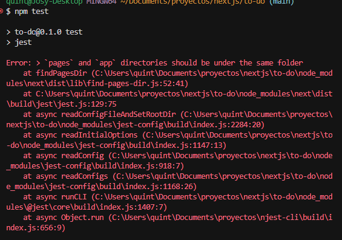
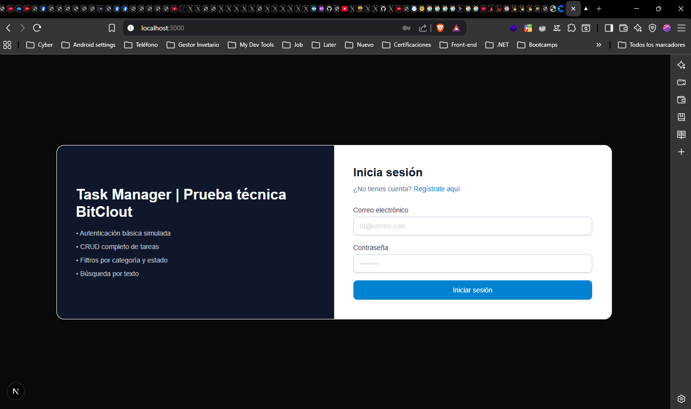
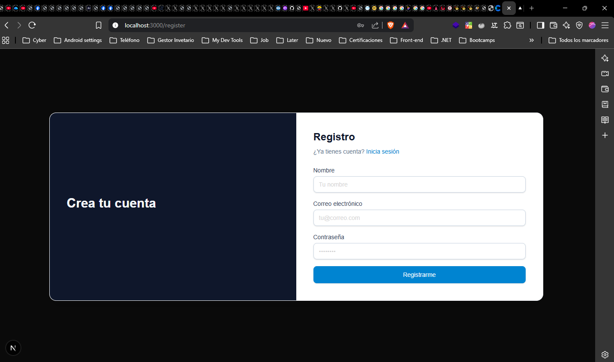
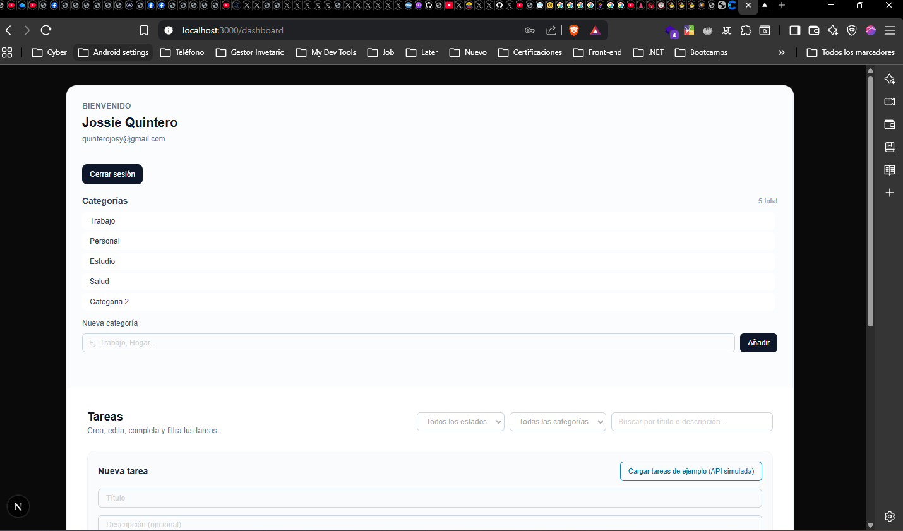
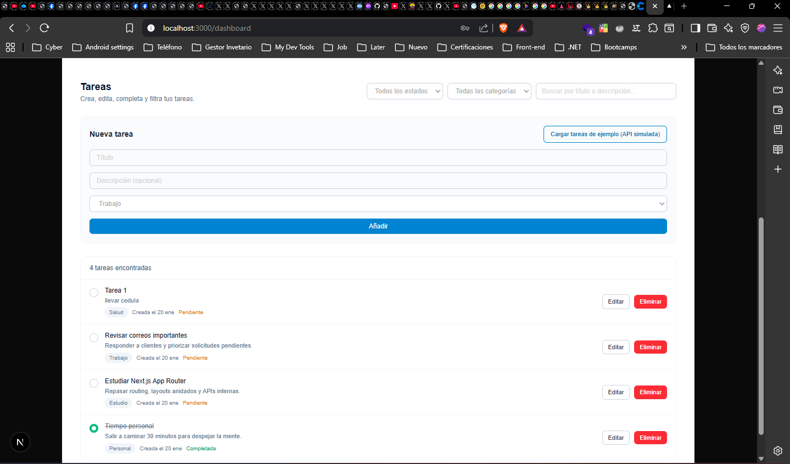
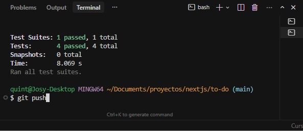
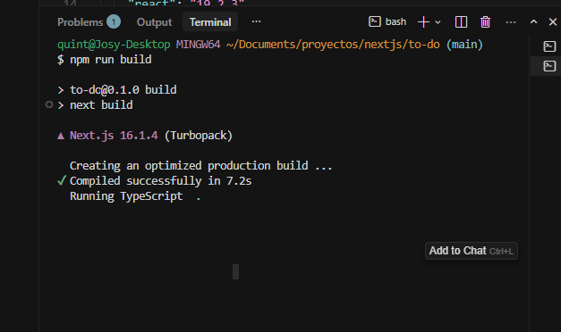
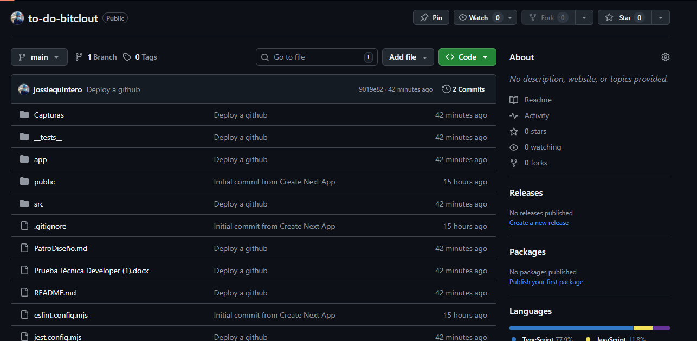
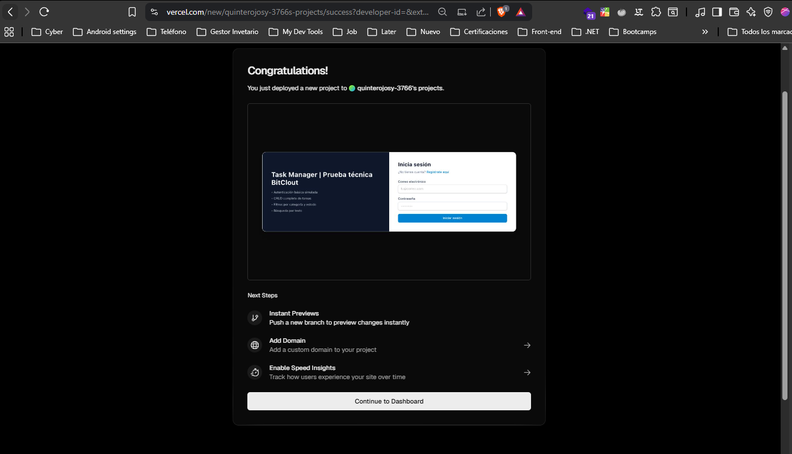

## Task Manager - Prueba Técnica

Aplicación web de gestión de tareas construida con **Next.js (App Router)**.  
Incluye autenticación simulada, CRUD de tareas con categorías, filtros/búsqueda y consumo de una API interna simulada.

---

### Instrucciones para correr el proyecto

1. **Instalar dependencias**

```bash
npm install
```

2. **Entorno de desarrollo**

```bash
npm run dev
```

Luego abre `http://localhost:3000` en el navegador.

3. **Build de producción**

```bash
npm run build
npm start
```

4. **Ejecutar tests unitarios**

```bash
npm test
```

---

### Funcionalidades principales

- Autenticación simulada:
  - Registro, login y logout sin backend real.
  - Persistencia del usuario autenticado en `localStorage`.
- Gestión de tareas:
  - Crear, editar, eliminar y marcar tareas como **pendientes** o **completadas**.
  - Cada tarea tiene título, descripción, categoría, fecha de creación y estado.
- Categorías:
  - Tres categorías iniciales por defecto (Trabajo, Personal, Estudio).
  - Posibilidad de crear nuevas categorías desde el dashboard.
- Filtros y búsqueda:
  - Filtro por categoría.
  - Filtro por estado (todas, pendientes, completadas).
  - Búsqueda por texto en título y descripción.
- API simulada:
  - Endpoint interno `GET /api/demo-tasks` que devuelve tareas de ejemplo.
  - Botón en el dashboard para cargar estas tareas demo y mezclarlas con las existentes.

---

### Patrón de diseño utilizado

La prueba pide implementar y documentar el uso de un patrón de diseño.  
En este caso se eligió el **Repository Pattern para manejo de datos**, de la lista propuesta (Observer, Factory, Strategy, MVC, Repository).

**¿Qué problema resuelve?**

En una app real, los datos pueden vivir en `localStorage`, venir de una API REST/GraphQL o de cualquier otra fuente.  
Si los componentes de React hablan directamente con cada una de estas fuentes, la lógica de UI se vuelve difícil de mantener y de testear.

El patrón **Repository** resuelve esto:

- **Encapsula el acceso a datos** (en este proyecto: `localStorage` y datos de ejemplo).
- Expone a la UI una **interfaz simple y estable** (`getTasks`, `login`, `logout`, etc.).
- Permite cambiar la implementación interna (por ejemplo, pasar de `localStorage` a una API real) **sin romper los componentes**.

**Dónde se usa**

- `AuthRepository` (`src/services/authRepository.ts`):
  - Gestiona usuarios y sesión actual en `localStorage`.
  - Provee métodos de alto nivel: `register`, `login`, `getCurrentUser`, `logout`.
  - Es consumido desde las páginas de autenticación (`app/page.tsx`, `app/register/page.tsx`) sin que estas conozcan `localStorage`.

- `TaskRepository` (`src/services/taskRepository.ts`):
  - Centraliza la lectura/escritura de tareas y categorías (`TASKS_STORAGE_KEY`, `CATEGORIES_STORAGE_KEY`).
  - Expone operaciones: `getTasks`, `saveTask`, `deleteTask`, `toggleTaskStatus`, `getCategories`, `saveCategory`.
  - Es usado por el dashboard (`app/dashboard/page.tsx`) para todas las operaciones de tareas y categorías.

Además, aunque existe una API simulada `GET /api/demo-tasks` (`app/api/demo-tasks/route.ts`),  
las tareas que llegan desde esa API también se guardan pasando por `TaskRepository`, manteniendo una única puerta de entrada a los datos.

**Relación con Strategy en filtros**

- La función de filtrado `filterTasks` (`src/modules/tasks/taskFilters.ts`) concentra la lógica de filtros (texto, categoría, estado) como función pura de dominio.
- Esta función es candidata natural a evolucionar hacia un **Strategy de filtros/ordenamientos** (distintas estrategias intercambiables).
- Para esta prueba se mantiene como una función simple y testeable, pero ya está separada de la UI y cubierta por tests unitarios.

---

### Decisiones técnicas destacadas

- **Next.js App Router**: se usa la carpeta `app/` para aprovechar layouts, route handlers (`/api`) y una estructura más modular.
- **Persistencia en `localStorage`**: elegida para simular un backend sencillo manteniendo el estado entre recargas sin necesidad de servidor externo.
- **API simulada con `/api/demo-tasks`**: implementada usando route handlers de Next.js para mostrar consumo de datos vía `fetch` dentro del dashboard.
- **Separación de dominio de tareas**:
  - Tipos y contratos en `src/modules/tasks/types.ts`.
  - Lógica de filtrado en `src/modules/tasks/taskFilters.ts`, como función pura y fácilmente testeable.
- **Estilos**: se usa Tailwind CSS (a través de `globals.css` y la config por defecto de Tailwind v4) para construir una interfaz limpia y consistente.

---

### Estructura del proyecto

Estructura alineada con la sugerida en la prueba (adaptada a App Router):
Cabe destacar que debido a las pruebas unitarias me apegue a la estrctura recomenda para el uso de App Router.


```text
app/
  layout.tsx        # Layout raíz
  page.tsx          # Login
  register/page.tsx # Registro
  dashboard/page.tsx# Dashboard de tareas
  api/demo-tasks/   # API simulada de tareas de ejemplo

src/
  pages/            # Reservado para pages clásicas (no se usa, se mantiene por requisitos)
  components/       # Lugar para componentes reutilizables
  modules/
    auth/           # Módulo reservado para lógica de auth adicional
    tasks/          # Tipos y lógica de dominio de tareas (filterTasks, tipos)
  services/
    authRepository.ts # Repository de autenticación
    taskRepository.ts # Repository de tareas/categorías
  data/             # Reservado para datos estáticos/fixtures
  utils/            # Utilidades genéricas si el proyecto crece
```


---

### Tests

- **Framework**: Jest React Testing Library.
- **Configuración**:
  - Archivo de configuración: `jest.config.mjs`, basado en `next/jest`.
  - Entorno de test: `jest-environment-jsdom`.
- **Test unitario incluido**:
  - `__tests__/taskFilters.test.ts`
  - Verifica el comportamiento de la función `filterTasks` (`src/modules/tasks/taskFilters.ts`), probando filtros por texto, categoría, estado y combinaciones.

Para ejecutar los tests:

```bash
npm test
```

---

### DarkMode
Implementado en global como predeterminado
```
@media (prefers-color-scheme: dark) {
  :root {
    --background: #0a0a0a;
    --foreground: #6e6e6e;
  }
}
```

### Capturas de pantalla


- Pantalla de login.

- Pantalla de registro.

- Dashboard - Categorias.

- Dashboard - Tareas y Filtro.

- Ejecución de Test

- Ejecución de Build


- Deploy en Github

- Deploy en Vercel



### Bonus 
•	Paginación o lazy loading ❌ 
•	Dark mode  ✅
•	Uso de Zustand o Context API para estado ❌
•	Deploy en Vercel ✅
